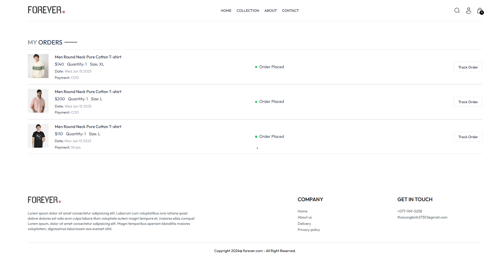

Overview
A full-stack e-commerce platform built using the MERN stack (MongoDB, Express.js, React.js, Node.js), featuring a responsive user interface, secure payment processing, and comprehensive admin dashboard.

##Clone the repository
```c
Clone the repository git clone https://github.com/yourusername/project-name.git
```

##Install dependencies for backend
```c
backend
npm install
```

##Install dependencies for frontend
```c
frontend
npm install
```

Create .env file in backend directory
```c
PORT=4000
MONGODB_URL=your_mongodb_url
JWT_SECRET=your_jwt_secret
STRIPE_SECRET_KEY=your_stripe_secret_key
```

Create .env file in frontend directory
```c
VITE_BACKEND_URL=http://localhost:4000
Running the Application
```

Start backend server
```c
cd backend
npm start
```

Start frontend development server
```c
cd frontend
npm run dev
```c

##API Endpoints
```c
Auth Routes
POST /api/auth/register
POST /api/auth/login
GET /api/auth/logout
```
```c
Product Routes
GET /api/products
GET /api/products/:id
POST /api/products (Admin)
PUT /api/products/:id (Admin)
DELETE /api/products/:id (Admin)
```

Order Routes
```c
POST /api/order/place
POST /api/order/stripe
GET /api/order/list (Admin)
PUT /api/order/status (Admin)
```

Project Structure

```c
project/
│
├── frontend/
│   ├── src/
│   │   ├── components/
│   │   ├── pages/
│   │   ├── context/
│   │   ├── assets/
│   │   └── App.jsx
│   │
│   └── package.json
│
├── backend/
│   ├── controllers/
│   ├── models/
│   ├── routes/
│   ├── middleware/
│   ├── config/
│   └── index.js
│
└── README.md
```

##USER:
Homepage : 


Collection :


Collection Filter :


About :


Product :


Cart User :


Order History :


Process to checkout :


User track order :


##ADMIN :
Add Item :


List Item :


History-order :


